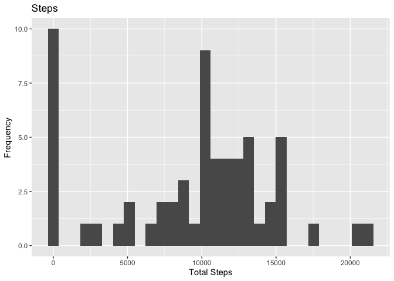
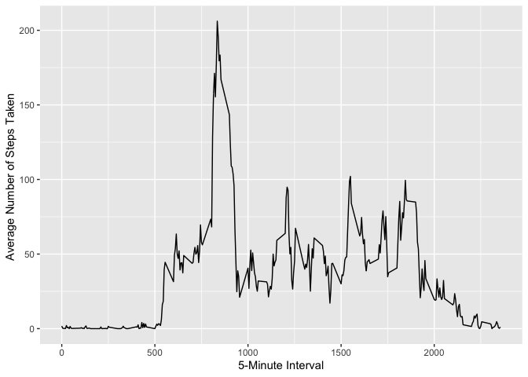
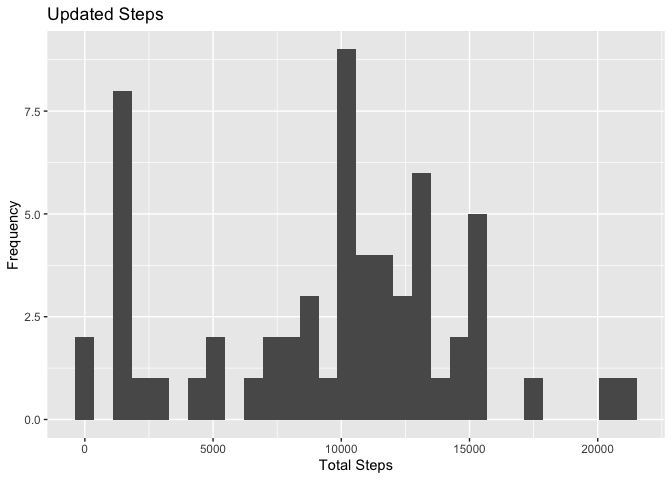
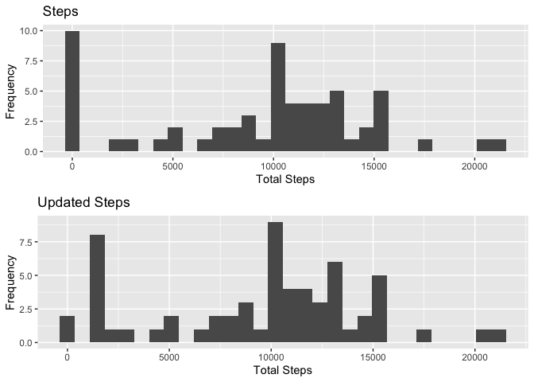
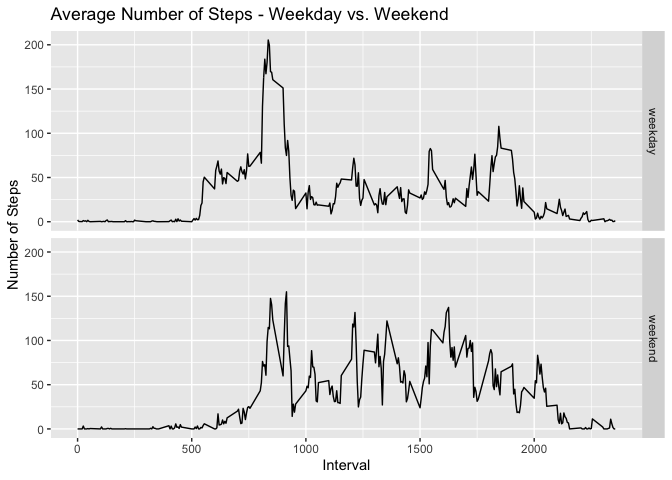

## Loading and preprocessing the data


## What is mean total number of steps taken per day?

```r
data_by_day <- activitydata %>% group_by(date) %>% summarize(totalsteps= sum(steps,na.rm = TRUE))
```

```
## `summarise()` ungrouping output (override with `.groups` argument)
```

```r
p1 <- qplot(data_by_day$totalsteps, geom = "histogram", main = "Steps", xlab = "Total Steps",ylab = "Frequency")
p1
```

```
## `stat_bin()` using `bins = 30`. Pick better value with `binwidth`.
```

<!-- -->

```r
mean_ts <- mean(data_by_day$totalsteps)
median_ts <- median(data_by_day$totalsteps)
print(paste("The mean is: ", mean_ts))
```

```
## [1] "The mean is:  9354.22950819672"
```

```r
print(paste("The median is: ", median_ts))
```

```
## [1] "The median is:  10395"
```


## What is the average daily activity pattern?

```r
data_by_interval <- activitydata %>% group_by(interval) %>% summarize(mean_ts= mean(steps,na.rm = TRUE))
```

```
## `summarise()` ungrouping output (override with `.groups` argument)
```

```r
p2 <- ggplot(data=data_by_interval,aes(x=interval,y=mean_ts)) + geom_line() + labs(x = "5-Minute Interval") + labs(y = "Average Number of Steps Taken ")
p2                 
```

<!-- -->

```r
max_5min_interval <- data_by_interval$interval[which.max(data_by_interval$mean_ts)]
avgstepsfor_max <- round(max(data_by_interval$mean_ts),digits = 2)
max_interval_data <- data.frame("5-minute Interval"= max_5min_interval, "Number of Steps" = avgstepsfor_max)
print(paste("Interval containing the most steps on average: ",max_5min_interval))
```

```
## [1] "Interval containing the most steps on average:  835"
```

```r
print(paste("Average steps for that interval: ",avgstepsfor_max))
```

```
## [1] "Average steps for that interval:  206.17"
```


## Imputing missing values

```r
missing_byrow <- sum(!complete.cases(activitydata))
imputation_median <- function(missing){
    replace(missing, is.na(missing), median(missing,na.rm = TRUE))}
updated_data <- activitydata %>% group_by(interval) %>% mutate(steps = imputation_median(steps))
head(updated_data)
```

```
## # A tibble: 6 x 3
## # Groups:   interval [6]
##   steps date       interval
##   <int> <date>        <int>
## 1     0 2012-10-01        0
## 2     0 2012-10-01        5
## 3     0 2012-10-01       10
## 4     0 2012-10-01       15
## 5     0 2012-10-01       20
## 6     0 2012-10-01       25
```

```r
updated_databyday <- updated_data %>% group_by(date) %>% summarize(totalsteps= sum(steps,na.rm = TRUE))
```

```
## `summarise()` ungrouping output (override with `.groups` argument)
```

```r
p3 <- qplot(updated_databyday$totalsteps, geom = "histogram", main = "Updated Steps", xlab = "Total Steps",ylab = "Frequency")
p3
```

```
## `stat_bin()` using `bins = 30`. Pick better value with `binwidth`.
```

<!-- -->

```r
updated_mean_ts <- mean(updated_databyday$totalsteps)
updated_median_ts <- median(updated_databyday$totalsteps)
grid.arrange(p1, p3,ncol = 1, nrow = 2)
```

```
## `stat_bin()` using `bins = 30`. Pick better value with `binwidth`.
```

```
## `stat_bin()` using `bins = 30`. Pick better value with `binwidth`.
```

<!-- -->

```r
print(paste("The updated mean is: ", updated_mean_ts))
```

```
## [1] "The updated mean is:  9503.86885245902"
```

```r
print(paste("The updated median is: ", updated_median_ts))
```

```
## [1] "The updated median is:  10395"
```

```r
data_compare <- data.frame(mean = c(mean_ts,updated_mean_ts), median = c(median_ts,updated_median_ts))
rownames(data_compare) <- c("Omitting NA Values","Imputing Median to NA Values")
print(data_compare)
```

```
##                                  mean median
## Omitting NA Values           9354.230  10395
## Imputing Median to NA Values 9503.869  10395
```


## Are there differences in activity patterns between weekdays and weekends?

```r
updated_data$date <- as.Date(updated_data$date)
updated_data$daytype <- ifelse(weekdays(updated_data$date) %in% c("Saturday","Sunday"),"weekend","weekday")
updated_data$daytype <- as.factor(updated_data$daytype)
updated_data_by_interval <- updated_data %>% group_by(interval,daytype) %>% summarize(mean_ts= mean(steps,na.rm = TRUE))
```

```
## `summarise()` regrouping output by 'interval' (override with `.groups` argument)
```

```r
p4 <- ggplot(data=updated_data_by_interval,aes(x=interval,y=mean_ts,)) + geom_line() + facet_grid(daytype ~.) + labs(y = "Number of Steps") + labs(x = "Interval") + 
ggtitle("Average Number of Steps - Weekday vs. Weekend")
p4 
```

<!-- -->

There are differences in activity patterns between weekdays and weekends. There appears to be a spike in steps during the weekdays possibly indicating individuals heading or commuting to work or school compared to the weekend when people decide to sleep in.There is also a higher spike during what could be the afternoon on the weekdays when people are getting lunch. There are also higher spikes in activity overall during the weekend days probably due to leisure time as opposed to the weekdays when people are at work or school. 
